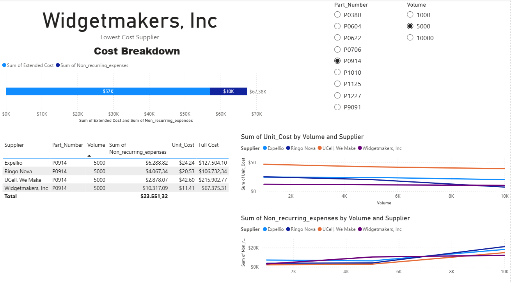
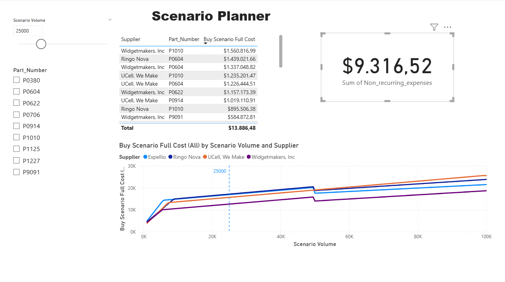
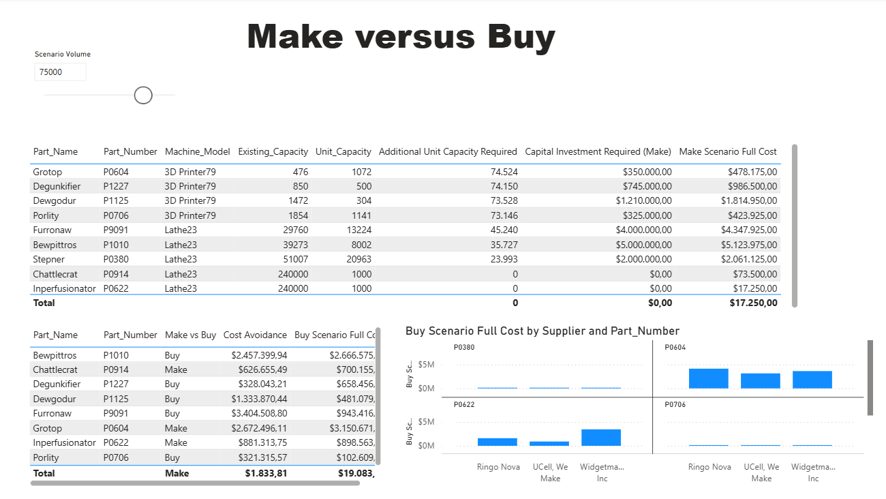

# 📊 Supply Chain Make vs Buy Analysis

A complete end-to-end supply chain analytics project built in Microsoft Power BI to support Make vs Buy decision-making using dynamic scenario analysis, supplier evaluation, manufacturing capacity planning, and quality-adjusted cost modeling.

---

# 🚀 Project Overview

This project simulates a real-world supply chain case study for a fictional company, **Tenate Industries**, which manufactures replacement parts for industrial pizza ovens.

The objective is to determine whether the company should:

- 🛒 **Buy** components from external suppliers
- 🏭 **Make** components internally

The project evolves through 3 major analytical stages:

1. Buy Option Analysis
2. Scenario Planning & Volume Analysis
3. Make vs Buy Optimization

---

# 🧩 Business Objectives

- Evaluate supplier quotes dynamically
- Compare supplier pricing across production volumes
- Build scenario-based procurement analysis
- Analyze internal manufacturing feasibility
- Calculate capital investment requirements
- Determine optimal Make vs Buy strategy
- Adjust procurement costs based on supplier quality yield
- Implement Row-Level Security (RLS)

---

# 🛒 Phase 1 — Buy Option Analysis

## 🎯 Objective

Evaluate supplier quotes and identify the lowest total procurement cost for each product and production volume combination.

---

## 📌 Key Concepts

### Supplier Quotes

Each supplier quote includes:

- Part Number
- Supplier Name
- Minimum Production Volume
- Unit Cost
- Non-Recurring Expenses (NRE)

---

## 💰 Cost Calculations

### Extended Cost

```DAX
Extended Cost =
Quotes[Unit Cost] * Quotes[Volume]
```

Represents only the purchasing cost of products.

---

### Full Cost

```DAX
Full Cost =
[Extended Cost] + Quotes[Non-Recurring Expenses]
```

Represents the total procurement cost.

---

## 📊 Visualizations Built

- Supplier quote comparison tables
- Unit cost vs volume line charts
- Non-recurring expense trend charts
- Lowest-cost supplier KPI card
- Cost breakdown stacked bar chart
- Interactive slicers for:
  - Part Number
  - Volume

---

## 🛠 DAX & Modeling Techniques

- Calculated Columns
- Bottom-N filtering
- Interactive report behavior
- Dynamic filtering using slicers
- Edit Interactions

---

## 🔍 Key Insight

Supplier pricing changes significantly with production volume. The supplier with the lowest unit cost is not always the supplier with the lowest total full cost due to non-recurring expenses.

---

# 📈 Phase 2 — Scenario Planning & Volume Analysis

## 🎯 Objective

Build a dynamic scenario analysis tool that evaluates supplier costs across production volumes beyond quoted values.

---

## 📌 Business Challenge

Real-world demand is uncertain. Companies rarely order exact quoted volumes, making dynamic scenario analysis critical for procurement planning.

---

## ⚙️ Scenario Volume Parameter

Created a dynamic numeric parameter:

| Setting | Value |
|---|---|
| Minimum Volume | 1,000 |
| Maximum Volume | 100,000 |
| Increment | 500 |
| Default Value | 15,000 |

Controlled through an interactive slicer.

---

## 📌 Scenario Full Cost Measure

### Dynamic Full Cost Logic

```DAX
Scenario Full Cost =
MINX(
    FILTER(
        Quotes,
        Quotes[Volume] <= [Scenario Volume Value]
    ),
    Quotes[Unit Cost] * [Scenario Volume Value]
        + Quotes[Non-Recurring Expenses]
)
```

---

## 📊 Advanced Visualizations

- Dynamic supplier cost trend analysis
- Volume-based supplier comparison
- Scenario constant reference line
- Lowest-cost supplier KPI
- Scenario planning dashboard

---

# 🔐 Row-Level Security (RLS)

Implemented project-specific security roles:

- Project Siliode Team Member
- Project Kerfuffle

Users only see records related to their assigned project.

---

## 🔍 Key Insight

Supplier competitiveness changes dramatically across different production volumes. Scenario planning enables more accurate procurement strategies compared to static quote analysis.

---

# 🏭 Phase 3 — Make vs Buy Optimization

## 🎯 Objective

Compare internal manufacturing costs against supplier procurement costs to determine the optimal sourcing strategy.

---

# 🏭 Internal Manufacturing Analysis

## 📌 Internal Manufacturing Data

Internal manufacturing estimates include:

- Cost per Unit
- Existing Manufacturing Capacity
- Machine Capacity
- Machine Investment Cost
- Machine Model

---

## 📌 Incremental Cost Logic

The model distinguishes between:

| Cost Type | Treatment |
|---|---|
| Sunk Costs | Ignored |
| Incremental Costs | Included |

Only new investments required to meet demand are included in the analysis.

---

# ⚙️ Capacity Gap Analysis

## Additional Capacity Required

```DAX
Additional Capacity Required =
MAX(
    0,
    [Scenario Volume Value]
        - Internal_Mfg_Resource_Estimates[Existing Capacity]
)
```

---

# ⚙️ Equipment Investment Calculation

## Machines Required

```DAX
Machines Required =
ROUNDUP(
    [Additional Capacity Required]
        / Internal_Mfg_Resource_Estimates[Unit Capacity],
    0
)
```

---

## Capital Investment Required

```DAX
Capital Investment Required =
[Machines Required]
*
Internal_Mfg_Resource_Estimates[Machine Fixed Cost]
```

---

## Make Scenario Full Cost

```DAX
Make Scenario Full Cost =
(
    [Scenario Volume Value]
    * Internal_Mfg_Resource_Estimates[Cost per Unit]
)
+
[Capital Investment Required]
```

---

# ⚖️ Make vs Buy Decision Engine

## 📌 Decision Logic

The dashboard dynamically recommends:

- 🏭 Make
- 🛒 Buy

based on whichever option has the lower total full cost.

---

## 📌 Cost Avoidance Measure

```DAX
Cost Avoidance =
ABS(
    [Make Scenario Full Cost]
    -
    [Buy Scenario Full Cost]
)
```

Measures the savings generated by selecting the optimal sourcing strategy.

---

# 🧪 Supplier Quality & Yield Adjustment

## 📌 Business Enhancement

The quality team identified supplier yield issues:

| Supplier | Yield Rate |
|---|---|
| Widgetmakers, Inc | 72% |
| Ringo Nova | 83% |
| Other Suppliers | 98% |

---

## 📌 Yield-Adjusted Procurement

```DAX
Required Order Quantity =
[Scenario Volume Value] / [Yield Rate]
```

This adjusts procurement quantities to account for defective units.

---

## 🔍 Key Insight

Supplier quality significantly impacts procurement cost. Lower-priced suppliers may become more expensive once yield losses are considered.

---

# 📊 Dashboard Features

✅ Dynamic Scenario Volume Slicer  
✅ Lowest Cost Supplier Identification  
✅ Make vs Buy Recommendation Engine  
✅ Cost Avoidance KPI  
✅ Manufacturing Capacity Planning  
✅ Supplier Yield Adjustment  
✅ Interactive Scenario Planning  
✅ Row-Level Security (RLS)

---

# 🛠 Tools & Technologies

| Tool | Purpose |
|---|---|
| Microsoft Power BI | Dashboard Development |
| DAX | Business Logic & Calculations |
| Power Query | Data Transformation |
| Data Modeling | Relationship Management |
| Row-Level Security | Access Control |

---

# 📷 Dashboard Preview

## Supplier Selection Dashboard



---

## Scenario Planning Dashboard



---

## Make vs Buy Analysis Dashboard



---

# 🚀 How to Use

1. Download `SCM analysis.pbix`
2. Open the file in Power BI Desktop
3. Adjust the Scenario Volume slicer
4. Explore:
   - Supplier rankings
   - Full cost analysis
   - Make vs Buy recommendations
   - Manufacturing investment requirements
   - Yield-adjusted supplier costs

---

# 📌 Business Value

This project demonstrates how supply chain analytics can support:

- Procurement optimization
- Manufacturing planning
- Capital investment decisions
- Demand uncertainty management
- Supplier quality evaluation
- Strategic sourcing decisions

The solution transforms static supplier quotes into a dynamic decision-support system.

---

# ⭐ Future Improvements

- Demand forecasting integration
- Monte Carlo simulation
- Supplier lead-time analysis
- Sustainability scoring
- Automated refresh pipelines
- Power BI Service deployment

---